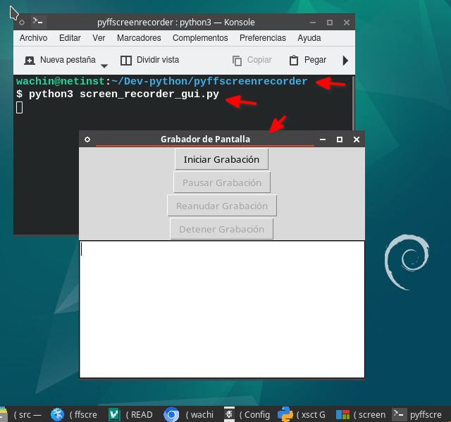

# pyffscreenrecorder
Capture and record your screen with ffmpeg ussing this Python GUI

## Características

Graba la pantalla en un rectángulo de 854x480 con el seguimiento del mouse, este rectángulo se moverá alrededor de la pantalla para capturar lo que más te importa según donde usted se mueva

---

# Manual de Usuario: Aplicación de Grabación de Pantalla

## Introducción

Esta aplicación permite grabar la pantalla de tu sistema Linux usando una interfaz gráfica simple. Con ella, puedes iniciar, pausar, reanudar y detener la grabación fácilmente. Además, el video resultante será guardado automáticamente en tu directorio actual.

## Requisitos

1. **Sistema operativo:** Linux Debian (MX Linux, AV Linux, etc), Ubuntu (Kubuntu, UbuntuStudio, etc)
2. **Dependencias:** Asegúrate de que los siguientes paquetes estén instalados:
```
sudo apt install ffmpeg python3-tk tk-dev python3-psutil x11-utils git
```

# Descarga el programa
Puedes clonar este repositorio
```
git clone https://github.com/wachin/pyffscreenrecorder
```

o lo puedes descargar dando clic en:

<>Code > Local > Download Zip

## Instrucciones de Uso

### 1. Abrir la Aplicación

1. **Navega al directorio** Abre una terminal en el lugar donde está el código de este programa

2. **Inicia la aplicación** Si usas MX Linux este trae incorporado un lanzador de scripts en python así que solo deberás darle clic derecho al archivo:

screen_recorder_gui.py

pero sino, lanzalo escribiendo en la terminal:

   ```bash
   python3 screen_recorder_gui.py
   ```

### 2. Interfaz Gráfica (GUI)

Una vez que la aplicación esté abierta:



 verás una ventana con varios botones. Aquí te explicamos cómo usar cada uno:

### 3. Botones de la Aplicación

- **Iniciar Grabación**: Al hacer clic en este botón, comenzará la grabación de la pantalla. Aparecerá un rectángulo de 854x480 píxeles que indica el área que está siendo grabada. Este rectángulo se moverá alrededor de la pantalla para capturar lo que más te importa según donde usted se mueva
- 


- **Pausar Grabación**: Si deseas pausar la grabación en cualquier momento, haz clic en este botón. El video dejará de grabarse temporalmente, pero la ventana de grabación seguirá visible.

- **Reanudar Grabación**: Este botón solo está disponible después de haber pausado la grabación. Haz clic aquí para continuar grabando desde donde lo dejaste.

- **Detener Grabación**: Una vez que hayas terminado de grabar, presiona este botón para detener la grabación. El video se guardará automáticamente con un nombre como `Out-[fecha-hora].mp4` en el mismo directorio donde se encuentra la aplicación.

- **Área de Texto**: En la parte inferior de la ventana hay un área de texto que muestra el estado actual del proceso de grabación. Aquí verás mensajes de `ffmpeg`, como la configuración y el progreso de la grabación.

### 4. Detalles Técnicos

- **Resolución de grabación**: La aplicación graba en una resolución fija de 854x480 píxeles.
- **Ubicación del archivo grabado**: El archivo de video se guarda en el mismo directorio donde ejecutas la aplicación, con un nombre que incluye la fecha y hora, por ejemplo: `Out-2024-09-22_14.30.45.mp4`.

### 5. Problemas Comunes

#### El botón "Detener Grabación" no funciona correctamente

Si has pausado la grabación y luego intentas detenerla, asegúrate de haber reanudado primero la grabación antes de detenerla. El botón de "Detener Grabación" ahora debería funcionar correctamente.

#### Script ffscreenrecord.sh
Si tienes problemas con permisos, asegúrate de que el script `ffscreenrecord.sh` que está en la carpta "src" tenga permisos de ejecución. En la terminal, ejecuta:

```bash
chmod +x ffscreenrecord.sh
```
o en el administrador de archivos dale clic derecho y en la pestaña "Permisos" marca ejecución.

---

## Preguntas Frecuentes (FAQ)

### 1. ¿Dónde se guarda el video?
El video se guarda en el mismo directorio desde el cual ejecutaste la aplicación.

### 2. ¿Qué hago si no tengo `ffmpeg` instalado?
Sigue las instrucciones en la sección "Instalar `ffmpeg`" para instalarlo en tu sistema Linux.

### 3. ¿Cómo cambio la resolución de grabación?
La aplicación está configurada para grabar siempre en 854x480 píxeles. Si deseas cambiar esta resolución, tendrás que modificar el script `ffscreenrecord.sh` manualmente.

### 4. ¿Qué pasa si cierro la aplicación mientras grabo?
Si cierras la aplicación sin detener la grabación, el proceso de grabación seguirá ejecutándose en segundo plano. Para detenerlo, abre el "Monitor del sistema" o usa el comando `kill` en la terminal para detener el proceso de `ffmpeg`.

---

## Notas finales

Esta aplicación es una manera sencilla de grabar tu pantalla en Linux sin tener que lidiar con complicadas opciones de línea de comandos. Si tienes alguna duda o problema, puedes consultar al desarrollador.

---

Dios les bendiga
